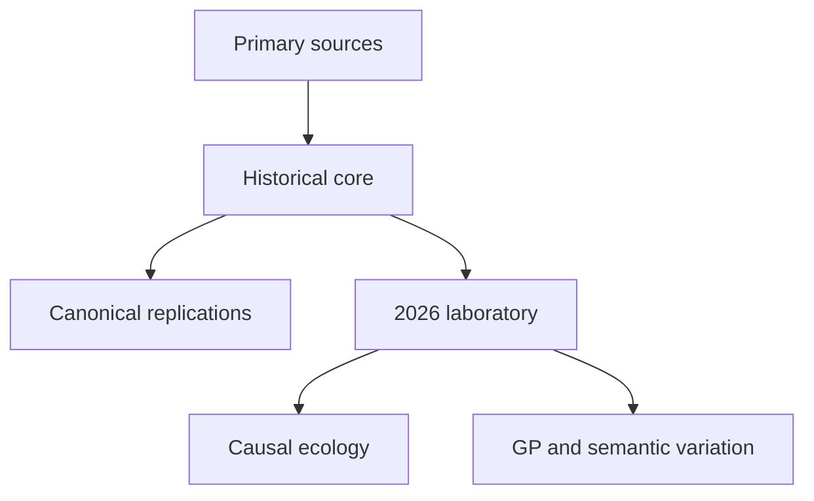

# Artificial Ecosystems

**The evolutionary-computation fossil record, reopened as an executable laboratory.**

This project revisits Conrad and Pattee's 1970 artificial ecosystem: a closed world in which organisms are not ranked by a fitness function, but must acquire finite matter, survive, interact, and reproduce. It then uses the same ecological accounting as a laboratory for modern genetic programming, artificial life, and language-assisted variation.

> **Methodological status**
>
> This is not a line-by-line port. We have not located the original program or a complete executable specification. In this repository, **Historical** means supported by a cited primary source, **Reconstruction** means a documented implementation choice, and **Extension** means a new experiment. The current code is a promising mechanism-inspired prototype; a source-faithful 1970 mode is still in progress.

[Conrad & Pattee (1970)](https://doi.org/10.1016/0022-5193(70)90077-9) · [EVOLVE IV](https://link.springer.com/chapter/10.1007/BFb0040799) · [Repair status](#current-repair-status) · [2026 research program](#the-2026-laboratory)

## The idea

Many conventional evolutionary-computation systems start with an evaluator: a score, objective, reward, or ranking. Conrad and Pattee instead asked what organization would emerge when selection was only the consequence of local action in a finite material economy.

Every chip must be somewhere—in the environment or in an organism. A successful behavior is not declared successful; it leaves descendants because it obtains and retains enough matter to do so.

**Selection is bookkeeping.**

That premise is still unusually relevant. It gives us a clean way to ask whether modern variation operators—typed GP, program synthesis, or LLM-assisted mutation—change evolvability while ecological survival, rather than an external judge, remains the selector.

## Target architecture: museum layer, laboratory layer

The repair plan will keep provenance visible by separating two kinds of work. The reviewed baseline does not yet enforce this boundary: an opt-in later-style modifier still lives inside `evolve1970` rather than in a laboratory namespace.

| Layer | Purpose | Rule |
|---|---|---|
| **Museum: 1970 reconstruction** | Recreate the published world and its canonical System I/System III contrasts | Every mechanism must trace to a primary source or appear in an ambiguity register |
| **Laboratory: 2026 extensions** | Test new ecology, communication, GP, and language-assisted variation | Extensions may add mechanisms, but never silently rewrite the historical baseline |



## Current repair status

The audit began at [`9290a7f`](https://github.com/ReloadLightly/artificial-ecosystems/tree/9290a7fae9d238ef7a015059baa0668fbf07f6ba). The table distinguishes working diagnostics from historical replications so planned work cannot be mistaken for a result.

| Track | Execution status | Defensible interpretation |
|---|---|---|
| Conserved-chip core | **Runs** | A compact, deterministic reconstruction; chip conservation holds in tested runs |
| Quiet versus noisy worlds | **Runs** | Matching differs between treatments; the historical System I/System III pattern is not yet reproduced faithfully |
| Repetition/execution experiment | **Runs; repaired diagnostic** | Separates repeated actions from indexed program positions; does not yet establish neutral historical sequence |
| Mutation-control experiment | **Runs; explicit extension** | Later-style modifier mode is opt-in and descriptive, not evidence of canalization |
| EVOLVE IV-inspired metabolism | **Runs** | A useful construction ablation; the present contact statistic does not by itself establish nonrandom niche formation |
| Text policies on the conserved-chip prototype | **Runs** | A deterministic keyword interpreter with a hand-written string mutator—not an LLM experiment |
| Typed controllers on IV physics | **Runs; repaired integration pilot** | Strict JSON programs execute, inherit, and mutate through an ID-keyed registry with a separate RNG; this is not yet a language-model experiment |
| Matched IV variation | **Runs; replay/integration pilot** | Five arms share initial programs, physics, and named seeds; four variation arms share an exact budget while the inheritance control spends none; the cache is synthetic |
| Real-model variation | **Offline contract only** | The cache schema can record model provenance, but no authentic model-response cache or live provider is integrated |

All ten commands advertised in the original README now execute. The two repaired IV-controller commands are integration pilots, not evidence for the former language-treatment claims; their old table remains withdrawn.

## Quick start

The working entry points were audited with Python 3.12.13 and NumPy 2.3.5. The repository currently declares NumPy 1.24 or newer.

```bash
python3 -m venv .venv
source .venv/bin/activate
python3 -m pip install -r requirements.txt

PYTHONPATH=src python3 -m evolve1970
PYTHONPATH=src python3 experiments/run_quiet_noisy.py
PYTHONPATH=src python3 experiments/run_unused.py
PYTHONPATH=src python3 experiments/run_amenability.py
PYTHONPATH=src python3 -m evolve4
PYTHONPATH=src python3 experiments/run_niches.py
PYTHONPATH=src python3 -m evolve_modern.iv
PYTHONPATH=src python3 experiments/run_language_iv.py
```

The matched IV pilot is deliberately offline. Build its deterministic fixture,
then replay all five arms into a new output directory:

```bash
IV_PILOT_DIR="$(mktemp -d)"
PYTHONPATH=src python3 experiments/run_iv_variation.py \
  --config experiments/configs/iv-variation-pilot-v1.json \
  --build-fixture-cache "$IV_PILOT_DIR/fixture.jsonl"
PYTHONPATH=src python3 experiments/run_iv_variation.py \
  --config experiments/configs/iv-variation-pilot-v1.json \
  --cache "$IV_PILOT_DIR/fixture.jsonl" \
  --output "$IV_PILOT_DIR/results"
```

This four-seed run is a protocol and deterministic-replay check, not a
statistical comparison. The repository also retains the
[synthetic fixture](experiments/cache/iv-variation-fixture-v1.jsonl) and its
[reference result bundle](results/reference/iv-variation-pilot-v1). See
[the matched IV variation protocol](docs/iv-variation.md).

The conserved total is the most important invariant:

```text
chips[place/body/pool] = ...   conserved = 4000
```

If it drifts, the simulated world is broken. Tests now verify every step in both
ordinary and modifier modes, and the matched IV runner enforces conservation
and non-negativity after every step. Older production entry points still need
the same always-on guard rather than boundary-only checks and printed totals.

## What the 1970 paper actually specifies

The published system is more particular—and stranger—than a generic six-action agent simulation. A genome of symbol pairs maps to a phenome over six symbols. Organisms occupy contiguous territories in a finite one-dimensional world, and a two-pass procedure first records marks/interactions and then resolves their material consequences.

The exact genomic alphabet and pair-to-symbol decoder still require a page-level primary citation; the repository's `{0,1,2,3}` alphabet and modulo decoder are reconstruction choices.

| Phenome symbol | Published role, summarized |
|---|---|
| **A / B** | Compare or match the local environmental state |
| **C** | Seek a conjugate for genetic exchange |
| **D** | Allocate a chip to repair |
| **E** | Enter or leave a parametric mode that conditionally changes phenome interpretation |
| **F** | Seek a symbiont and participate in chip sharing |

Reproduction follows automatically when an organism doubles its material size; it is not one of the six phenome symbols. Recognition for conjugation and symbiosis is heritable. Death and excess matter return locally along places associated with the organism's phenome, rather than entering a global rain pool.

### Fidelity matrix

| Mechanism | Published target | Current implementation | Status |
|---|---|---|---|
| Update semantics | Mark first, resolve consequences second | Randomized sequential actions mutate shared state immediately | **Replace for historical mode** |
| Phenome | A–F comparison, conjugation, repair, parameterization, symbiosis | `collect`, `forage`, `cooperate`, `repair`, `reproduce`, `wait` | **Reconstruct** |
| Reproduction | Automatic after material doubling | Explicit cyclic `reproduce` action plus threshold | **Reconstruct** |
| Resource allocation | Marks compete for place chips by integer division | Fixed harvest amount with a matching bonus | **Reconstruct** |
| Death and detritus | Spatial return associated with phenome positions | Global matter pool followed by random rain | **Reconstruct** |
| Sexuality and symbiosis | Evolvable recognition codes | Fixed global recombination probability; generic cooperation | **Missing** |
| Later EVOLVE modifiers | Separate later experiments | Opt-in via `modifier_enabled`; ordinary runs execute every complete pair | **Boundary repaired; historical semantics remain exploratory** |

The appropriate claim today is **source-transparent conceptual reconstruction**, not “faithful recreation.” The latter becomes defensible when the historical mode, ambiguity register, tests, and reference results agree with the primary sources.

## Canonical historical questions

Conrad and Pattee's 1970 paper contrasted a stable System I with a noisy System III; these treatment names are not the later EVOLVE I/EVOLVE III models. Their reports include homogenization and very low turnover in the quiet system, and continuing succession, changing composition, symbiosis, increasing environmental utilization, and population oscillation in the noisy system.

The next historical milestone is not another headline metric. It is a paired, source-faithful reproduction suite:

1. implement the A–F phenome and genuine mark/resolve update;
2. implement automatic reproduction, spatial detritus return, and recognition codes;
3. freeze named `system-i.toml` and `system-iii.toml` configurations;
4. record births, deaths, genealogy, executed positions, material flows, and recognition events;
5. run matched seeds with uncertainty intervals and publish the raw result bundle;
6. report observations that fail as clearly as those that succeed.

## The 2026 laboratory

The modern experiment should not merely put a language model inside each organism. The sharper question is:

> **Can semantic variation change evolvability when selection remains entirely ecological?**

### Flagship experiment: matched variation operators

The first matched pilot now holds the executable language, initial programs,
physics, master seeds, and exact proposal budget fixed while changing the
variation path. It includes an inheritance-only negative control.

| Arm ID | Implemented treatment |
|---|---|
| `inherit_only` | Exact parent inheritance; no proposal budget is spent |
| `typed_point_v1` | Field-uniform typed point edit with a deterministic adjacent value |
| `random_atomic_edit_v1` | Uniform draw from every valid one-atomic-edit neighbour |
| `typed_homologous_recombination_v1` | Copy one atomic-compatible typed leaf from a living donor |
| `cached_proposal_fixture_v1` | Replay integrity-checked synthetic proposals from an offline fixture |

Named streams provide matched initial conditions and common seeds for each
mechanism. They are not permanent event-by-event common random numbers: after
programs and ecological states diverge, stateful streams can consume different
numbers of draws.

Each budget unit permits one operator response and at most one candidate
validation, with no retry or repair. Invalid, unchanged, multi-field,
non-atomic, and recorded provider-failure responses consume one unit and
inherit the exact parent. A cache miss or integrity mismatch stops the run. The
schema-v1 program is a flat seven-leaf product, so homologous leaf
recombination is **not subtree GP**.

The committed four-seed configuration is intentionally too small for rankings,
p-values, confidence intervals, or superiority claims. It records proposal
outcomes; normalized population-occupancy AUC; ceiling and role-coexistence
fractions; extinction step; final living-body matter; turnover; program
richness; raw ecological diagnostics; and per-step invariants. It does not yet
measure general evolvability, offspring viability as a separate endpoint,
descendant establishment, robustness, behavioral novelty, shock recovery,
niche formation, or persistent causal innovation.

The fixture cache is generated by a deterministic random-edit test double. It
validates addressing, provenance, adjudication, and replay—never model or LLM
performance. A later real-model arm must freeze authentic responses together
with provider, model and prompt revisions, decoding settings, request identity,
raw output, usage, and checksums; ecosystem replay must still make no model call.

### A conjectural EVOLVE V (2026 extension)

The 1970 paper itself points toward richer ecological control: local communication, growth regulation, territoriality, self-thinning, and faster detritus cycling. A compelling continuation would ask:

> **Can evolvable local communication and restraint prevent quiet-world stasis and noisy-world overcompetition while preserving succession—without a global fitness function?**

Add costly local signals and separately evolvable sender/receiver rules. Compare communication off, cost-matched random signals, send-only, receive-only, and signal-permutation interventions. Treat mutual information as supporting evidence; causal behavior change under message intervention is the primary test.

### Longer-horizon directions

- **Causal niche construction.** Trace metabolite provenance and compare cross-type contact with occupancy-preserving permutation nulls and placebo construction.
- **Evolvable chemistry.** Let genomes encode material transformations and ask whether persistent new trophic dependencies arise.
- **Evolvable genotype–phenotype maps.** Coevolve programs and their interpreter/codebook, bringing Pattee's symbol–matter problem into the model itself.
- **Major transitions.** Add costly adhesion, shared stores, local signaling, and collective fission to test whether heritable ecological individuals emerge without group scores.
- **Open-endedness with controls.** Distinguish exploratory, expansive, and transformational novelty; do not equate a rising genotype count with open-ended evolution.

Modern work on [LLMs as evolutionary operators](https://arxiv.org/abs/2206.08896), [LLM-based genetic programming](https://arxiv.org/abs/2401.07102), and [ShinkaEvolve](https://proceedings.iclr.cc/paper_files/paper/2026/hash/7886b9bafe76c52fd568db10ff9772df-Abstract-Conference.html) supplies useful operator designs. Pattee and Sayama's argument for [evolved open-endedness](https://direct.mit.edu/artl/article-abstract/25/1/4/2911/Evolved-Open-Endedness-Not-Open-Ended-Evolution) supplies the more important conceptual constraint: open-endedness should become part of what the system explains.

## Reproducibility contract

Every canonical result should be generated from a committed artifact rather than copied by hand into prose.

```text
experiments/
  configs/                 # named, immutable treatments
  run_iv_variation.py      # build a fixture cache or replay the matched pilot
results/reference/
  <experiment>-v1/
    manifest.json          # revision/source hashes, environment, config, seeds
    trajectories.jsonl     # raw time series
    summary.json           # descriptive summaries or preregistered estimates
    checksums.json
    figures/
tests/
  test_conservation.py
  test_replay.py
  test_entrypoints.py
  test_historical_semantics.py
```

The minimum release bar is:

- conservation and non-negativity checked after every step;
- deterministic fixed-seed replay;
- separate named random streams for initialization, scheduling, reproduction, mortality, condition decay, variation gating, and operator events;
- smoke tests for every documented command;
- persistent genealogy and event logging;
- dependency bounds plus a frozen canonical environment;
- tables and figures generated from versioned result artifacts;
- explicit labels for **verified**, **approximate**, **exploratory**, and **planned** claims.

## Repository guide

| Path | Role |
|---|---|
| [`src/evolve1970`](src/evolve1970) | Current conserved-chip prototype |
| [`src/evolve4`](src/evolve4) | EVOLVE IV-inspired physics and typed controller boundary |
| [`src/evolve_modern`](src/evolve_modern) | Validated controller programs, registry, matched operators, and strict offline proposal cache |
| [`experiments`](experiments) | Runnable comparisons |
| [`docs/iv-variation.md`](docs/iv-variation.md) | Matched IV variation protocol, artifact contract, and claim limits |
| [`docs/original-model.md`](docs/original-model.md) | Quarantined pre-audit note; not the current fidelity statement |
| [`docs/evolve-family.md`](docs/evolve-family.md) | Quarantined pre-audit timeline; source-by-source repair pending |

Each experiment page should follow the same evidence template: primary-source claim; research question; operationalization; reconstruction deviations; hypothesis and null; configuration and seeds; artifact-generated results with uncertainty; robustness checks; narrow interpretation; limitations; exact reproduction command.

## Roadmap

- [x] **P0 — Repair historical diagnostics:** separate repetition from execution coverage and make the later mutation-control modifier explicit.
- [x] **P0 — Repair the IV controller boundary:** preserve controller-off physics, add typed intents and programs, isolate controller randomness, and restore both commands as integration pilots.
- [x] **P2 — Build the matched IV variation pilot:** identical starts, named streams, five arms, an exact proposal budget, fail-closed fixture replay, and deterministic artifacts.
- [ ] **P0 — Finish the evidence surface:** keep the old IV-language table withdrawn and finish factual corrections in quarantined legacy pages.
- [ ] **P0 — Finish the trust layer:** add CI, packaging, a lock file, and automated validation of committed result bundles.
- [ ] **P1 — Build strict 1970 mode:** A–F phenome, mark/resolve semantics, local detritus, automatic reproduction, recognition codes, and separate System I/III configurations.
- [ ] **P1 — Re-test EVOLVE IV:** flux provenance, spatial nulls, density controls, and partner-removal knockouts.
- [ ] **P2 — Run an inferential operator study:** preregistered estimands, adequate independent replicates, robustness checks, and ecological selection only.
- [ ] **P2 — Add genuine GP and cached model variation:** a recursive typed language for subtree GP, plus authentic versioned model responses and deterministic offline replay.
- [ ] **P3 — Explore communication, evolvable chemistry, codebooks, and new ecological individuals.**

## Sources and citation

Start with the primary sources:

- Michael Conrad and Howard H. Pattee, [“Evolution Experiments with an Artificial Ecosystem”](https://doi.org/10.1016/0022-5193(70)90077-9), *Journal of Theoretical Biology* 28, 1970.
- Michael Conrad and Mateen M. Rizki, [“The Artificial Worlds Approach to Emergent Evolution”](https://pubmed.ncbi.nlm.nih.gov/2627568/), 1989.
- Jon Brewster and Michael Conrad, [“Evolve IV: A Metabolically-Based Artificial Ecosystem Model”](https://link.springer.com/chapter/10.1007/BFb0040799), 1998.
- Jon J. Brewster and Michael Conrad, [“Computer Experiments on the Development of Niche Specialization in an Artificial Ecosystem”](https://doi.org/10.1109/CEC.1999.781957), 1999.
- Howard H. Pattee and Hiroki Sayama, [“Evolved Open-Endedness, Not Open-Ended Evolution”](https://direct.mit.edu/artl/article-abstract/25/1/4/2911/Evolved-Open-Endedness-Not-Open-Ended-Evolution), 2019.

Please cite the original papers when discussing their systems, and cite a tagged release of this repository when discussing this implementation. A `CITATION.cff` and archival DOI are planned for the first reproducible release.

## Contributing

Historical corrections are especially welcome. A useful issue or pull request should identify the primary source and page/section, distinguish the published mechanism from the proposed reconstruction, and include a test when behavior changes.

## License

Code in this repository is MIT licensed. The historical papers remain under their publishers' copyrights. The repository may include brief, attributed quotations but does not reproduce the papers or the unrecovered original source code.
