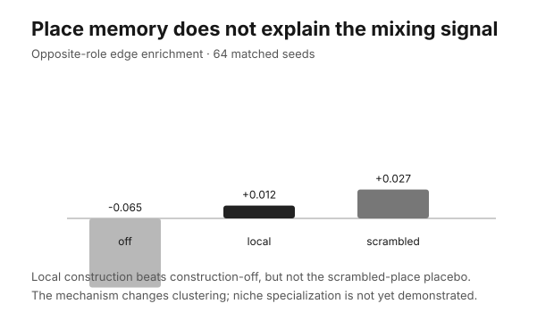

# Artificial Ecosystems

**A conserved-matter artificial-life laboratory for asking whether ecology can select programs without an external fitness function.**

Michael Conrad and Howard Pattee’s 1970 proposal was radical and still useful: put organisms in a finite material world and let survival and reproduction—not a hand-written score—decide which programs persist. This repository reconstructs that idea, adds an EVOLVE IV-inspired metabolic world, and uses small causal experiments to discover what the model actually does.

It is **not** a recovered historical implementation and **not yet** a faithful replication. The standard is now simple: pose a question, run the intervention, publish the result, and write down what was learned.



## Current result: place memory does not explain the mixing signal

The experiment asks:

> Does persistent, place-specific environmental memory make producers and recyclers form complementary local associations?

We ran **64 matched seeds** in three treatments:

| treatment | intervention |
|---|---|
| **construction off** | organisms cannot modify place conditions |
| **local construction** | organisms modify local conditions and those conditions remain in place |
| **place memory scrambled** | construction remains active, but condition values are permuted across places between steps |

The primary statistic is the fraction of local producer–recycler edges minus the random-mixing expectation implied by the current role counts. Unlike the older raw-contact statistic, it does not rise automatically with density or role balance.

| treatment | edge enrichment | local edges | raw cross-type contact | late population |
|---|---:|---:|---:|---:|
| construction off | −0.065 | 74.4 | 0.640 | 66.2 |
| local construction | +0.012 | 108.3 | 0.807 | 59.0 |
| place memory scrambled | +0.027 | 62.5 | 0.762 | 57.6 |

Local construction improves edge enrichment over construction-off by **+0.077**. But it is **−0.015** below the scrambled-place placebo, with a paired-bootstrap 95% interval of **−0.029 to −0.001**.

### What this teaches us

Construction makes the ecosystem look more cooperative under the old contact metric, but it also produces far more local edges: it creates **clumping**. Destroying the place identity of environmental traces does not destroy the composition-adjusted mixing signal.

The current mechanism therefore produces **environmental heterogeneity and spatial structure**, not demonstrated niche specialization caused by persistent local memory. That negative result is progress. The next mechanism must make *where* a trace is located causally useful, rather than merely making more traces and denser clusters.

Reproduce the complete result:

```bash
python3 -m venv .venv
source .venv/bin/activate
python3 -m pip install -r requirements.txt

PYTHONPATH=src python3 experiments/run_niches.py \
  --output /tmp/causal-niches-v1
```

The command writes `runs.csv`, `summary.json`, and `figure.svg`. The committed bundle is in [`results/causal-niches-v1`](results/causal-niches-v1).

## The recalibration

The repository briefly became a project about preparing experiments rather than doing them. A model-response collection and world-qualification stack grew to thousands of lines of code, tests, protocol prose, hashes, manifests, and replay artifacts **before one authentic model response was collected**. The remaining matched-variation pilot used a synthetic random-edit cache and only four seeds; it demonstrated plumbing, not a scientific advantage for model-guided variation.

Those protocol-only layers are no longer on `main`. They remain recoverable from commit [`82938ca`](https://github.com/ReloadLightly/artificial-ecosystems/tree/82938ca4442f86da346f59d6f1fefd805ccf4d97), so deleting them from the active project loses no knowledge. The typed-program primitives remain because they are small reusable ingredients for a future experiment, but they are not presented as a result.

A material-accounting bug was also fixed: sparse initialization could mint a fallback unit when an organism landed on an empty metabolite pile. Zero intake is now allowed, so initialization respects the closed-material premise even in sparse worlds.

## Honest project status

| component | status | defensible claim |
|---|---|---|
| `evolve1970` conserved-chip world | runnable reconstruction | finite matter is conserved; this is not the full published 1970 mechanism |
| quiet/noisy treatment | four-seed diagnostic | matching changes under this repository’s disturbance process; no historical replication claim |
| repetition/execution treatment | diagnostic | distinguishes repeated actions from unexecuted program positions |
| mutation-control proxy | explicit extension | studies a simple heritable mutation modifier; not an EVOLVE amenability replication |
| EVOLVE IV-inspired metabolism | runnable laboratory | producer/recycler exchange, construction, and material conservation |
| causal niche intervention | **64-seed result** | construction changes clustering; place-specific memory is not supported as the cause of complementary mixing |
| typed IV controllers | integration primitive | validated programs can control movement, construction, and reproduction while physics retains matter accounting |
| natural-language policy prototype | toy compiler | keywords map text to actions; no language model is called |

## Historical reconstruction and 2026 extension

### Reconstruct the historical mechanism honestly

The 1970 paper describes a one-dimensional finite world, symbol-pair genomes, an A–F phenome, local territories, conjugation, repair, parameterization, symbiosis, automatic reproduction after material doubling, and a mark-then-resolve update process. The current `evolve1970` package uses different actions and sequential state updates. It is therefore a **mechanism-inspired reconstruction**, not a source-faithful port.

The next historical milestone is one minimal System I/System III implementation tied to page-level primary-source evidence, followed immediately by an attempt to reproduce one published contrast. No provenance framework is needed before that experiment exists.

### Add a 2026 twist without replacing ecology

The interesting modern question is not whether an LLM can score organisms. It is whether a model can occasionally propose useful **program variation** while the ecosystem remains the selector.

A legitimate model treatment must be allowed to propose coherent program-level changes, not be restricted to one atomic leaf edit. It should be compared with cost-matched typed and random baselines on ecological outcomes such as descendant establishment, shock recovery, and reachable behavioral novelty.

The first study will therefore be deliberately tiny: at most **24 frozen proposals**, one JSONL file, one replay script, no live calls during ecology, and no new collection framework. It runs only after explicit model and spending authorization.

## Research rules

1. **Question before code.** Every change names the empirical question and the observable that can answer it.
2. **Result in the same step.** Infrastructure is added only when the same change uses it to produce evidence.
3. **Small matched worlds first.** Start with a cheap intervention, enough seeds for uncertainty, and a control that can falsify the preferred story.
4. **Write the lesson.** A surprising null or negative result is progress; another abstraction layer is not.
5. **Delete dead scaffolding.** Git history is the archive. `main` is for runnable models, current experiments, and results.

## Run the laboratory

```bash
PYTHONPATH=src python3 experiments/run_niches.py
PYTHONPATH=src python3 -m evolve1970
PYTHONPATH=src python3 experiments/run_quiet_noisy.py
PYTHONPATH=src python3 experiments/run_unused.py
PYTHONPATH=src python3 experiments/run_amenability.py
PYTHONPATH=src python3 -m evolve4
PYTHONPATH=src python3 experiments/run_language_iv.py
PYTHONPATH=src python3 -m pytest -q
```

Repository map:

```text
src/evolve1970/             conserved-chip historical reconstruction
src/evolve4/                metabolic exchange and construction world
src/evolve_modern/          typed programs and toy text-policy prototype
experiments/run_niches.py   current evidence-bearing experiment
results/causal-niches-v1/   64-seed result bundle
docs/                       narrow notes for the remaining diagnostics
```

The material invariant is non-negotiable:

```text
nutrient + waste + matter in living bodies = configured total
```

Tests cover conservation, deterministic execution, controller boundaries, program validation, and the density-aware niche statistic. Tests support research; passing tests are not themselves a research result.

## Next three experiments

1. **Partner-removal test.** Remove one metabolic role after coexistence and measure whether locally constructed environments delay collapse or accelerate recovery when the partner returns.
2. **Metabolite-provenance test.** Track who produced the matter another lineage consumes, separating true trophic dependence from spatial adjacency.
3. **Semantic-variation micro-study.** Compare at most 24 program-level model proposals with typed and random baselines on descendant establishment and shock recovery, with ecological selection only.

No fourth milestone is planned until one of these produces a result.

## Sources

- Michael Conrad and Howard H. Pattee, “Evolution Experiments with an Artificial Ecosystem,” *Journal of Theoretical Biology* 28 (1970), [doi:10.1016/0022-5193(70)90077-9](https://doi.org/10.1016/0022-5193(70)90077-9).
- Jon Brewster and Michael Conrad, “Evolve IV: A Metabolically-Based Artificial Ecosystem Model” (1998).
- Jon J. Brewster and Michael Conrad, “Computer Experiments on the Development of Niche Specialization in an Artificial Ecosystem” (1999), [doi:10.1109/CEC.1999.781957](https://doi.org/10.1109/CEC.1999.781957).
- Howard H. Pattee and Hiroki Sayama, “Evolved Open-Endedness, Not Open-Ended Evolution,” *Artificial Life* 25 (2019).

Please cite the historical papers for their systems and a tagged repository release for this implementation.

## License

MIT. The historical publications remain under their publishers’ copyrights.
