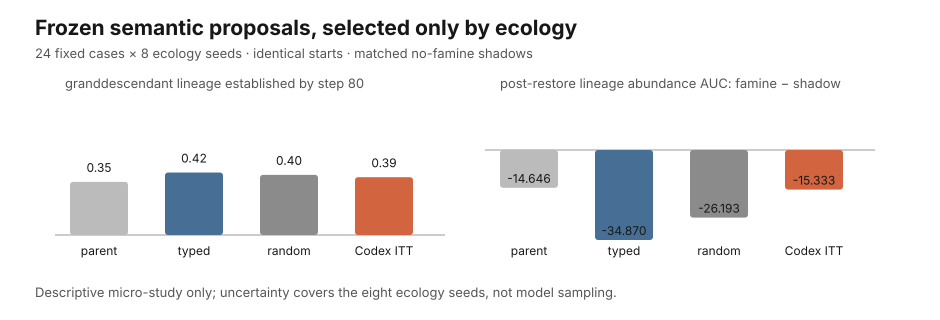

# Artificial Ecosystems

**A conserved-matter artificial-life laboratory for asking whether ecology can select programs without an external fitness function.**

Michael Conrad and Howard Pattee’s 1970 proposal was radical and still useful: put organisms in a finite material world and let survival and reproduction—not a hand-written score—decide which programs persist. This repository reconstructs that idea, adds an EVOLVE IV-inspired metabolic world, and uses small causal experiments to discover what the model actually does.

It is **not** a recovered historical implementation and **not yet** a faithful replication. The standard is now simple: pose a question, run the intervention, publish the result, and write down what was learned.



## Current result: no observed semantic-proposal establishment advantage in the first fixed bank

The modern experiment asks:

> Can a language-model agent propose joint controller changes that ecology favors, without giving it a fitness score or ecological observations in the explicit task message?

We froze **24 proposal cases** before collection: six role-balanced parent programs crossed with all four three-field masks over movement, construction timing, reproduction threshold, and crowding avoidance. Each model, typed, and random candidate had to change exactly the same three controls while preserving role, taste, and construction trait. This makes the initial bodies, positions, matter, and named ecological random streams identical within each case and seed. In the result figure, “identical starts” means identical **physical and ecological** starts; the assigned controller program is the intended treatment.

Every candidate entered as one rare founder among 16 organisms. Later variation was disabled. After 80 steps, establishment meant that at least one living granddescendant of that founder remained. A 20-step famine then reduced harvest from four units to one; recovery was compared with a no-famine shadow copied from the exact hashed pre-shock state.

| assigned program | granddescendant establishment | lineage alive at famine end (ITT) | lineage-abundance AUC gap¹ | effective-action novelty |
|---|---:|---:|---:|---:|
| exact parent | 0.354 | 0.208 | −14.6 | 0.000 |
| typed macro | 0.417 | 0.354 | −34.9 | 0.464 |
| same-mask random | 0.401 | 0.328 | −26.2 | 0.462 |
| Codex-agent assignment | 0.385 | 0.292 | −15.3 | 0.467 |

¹ Famine minus matched no-famine shadow over 60 restored steps; less negative is better. Both famine columns are unconditional intention-to-treat summaries over every assignment, not conditional on prior establishment. The frozen bundle’s “famine resilience” shorthand refers only to this response measure, not to a conditional or mechanistic resilience estimate.

The primary paired differences were **−0.031** against the typed macro and **−0.016** against same-mask random variation. Exploratory t-based 95% reference intervals across the eight ecology-seed effects were −0.110 to +0.047 and −0.149 to +0.117, respectively. In this fixed case bank, semantic proposals therefore showed **no observed establishment advantage**; the wide intervals are not equivalence evidence.

The secondary famine result points in a different direction. The Codex assignment lost 19.5 fewer focal-lineage organism-count steps than the typed macro and 10.9 fewer than random, but the corresponding ecology-seed intervals also crossed zero. Its loss was almost identical to exact-parent inheritance. This is an **absolute**, unnormalized AUC: the Codex lineage was already smaller before famine (mean share 0.0475 versus 0.0694 typed and 0.0537 random), so it could mechanically have fewer lineage members to lose. A growth–loss tradeoff is a hypothesis—the recorded proposals favored higher reproduction thresholds and `stay_if_fed` more often than the typed baseline—not an identified resilience mechanism.

### What was actually collected

The cache contains **24/24 valid final answers** and 22 distinct JSON programs. They were captured from fresh ChatGPT Work Codex subagent tasks requesting `gpt-5.6-sol` at low reasoning effort, using `fork_turns="none"` and no application retry. The study supplied no API key and made no direct provider API call. The single cache timestamp records batch serialization and attestation, not provider-side or per-task completion telemetry.

This is **orchestrator-attested agent-surface output**, not provider-authenticated model telemetry. Backend revision, provider request IDs, wire data, hidden instructions, tool activity, internal retries, and subscription usage were not exposed. The result is conditional on these exact 24 answers, one random proposal per case, this small program language, this world, and eight ecology seeds. Common random streams match at initialization but cannot stay draw-for-draw aligned after treatment trajectories diverge. This is not evidence that an LLM beats genetic programming—or that it is compute- or cost-efficient.

Reproduce the offline ecology and all derived artifacts:

```bash
PYTHONPATH=src python3 experiments/run_semantic_variation.py \
  --output /tmp/semantic-variation-v1
```

The replay reads [`experiments/cache/semantic-variation-v1.jsonl`](experiments/cache/semantic-variation-v1.jsonl); it makes no model or network call. The committed [`results/semantic-variation-v1`](results/semantic-variation-v1) bundle contains all 768 case–seed–arm rows, the structured summary, figure, and checksums. A second clean replay under the recorded Python 3.12.13 and NumPy 2.3.5 environment reproduced every artifact byte-for-byte; other compatible versions should preserve the analysis but are not claimed to produce byte-identical serialization.

## Earlier causal result: place memory does not explain the mixing signal

The experiment asks:

> Does persistent, place-specific environmental memory make producers and recyclers form complementary local associations?

We ran **64 matched seeds** in three treatments. Each treatment derives independent named streams for initialization, scheduling, reproduction, mortality, and condition decay from the same master seed, avoiding the legacy single-RNG coupling between mechanisms:

| treatment | intervention |
|---|---|
| **construction off** | organisms cannot modify place conditions |
| **local construction** | organisms modify local conditions and those conditions remain in place |
| **place memory scrambled** | construction remains active, but condition values are permuted across places between steps |

The primary statistic is the fraction of local producer–recycler edges minus the random-mixing expectation implied by the current role counts. Unlike the older raw-contact statistic, it does not rise automatically with density or role balance.

| treatment | edge enrichment | local edges | raw cross-type contact | late population |
|---|---:|---:|---:|---:|
| construction off | −0.068 | 75.2 | 0.635 | 65.3 |
| local construction | +0.018 | 112.6 | 0.814 | 61.9 |
| place memory scrambled | +0.023 | 64.1 | 0.762 | 58.0 |

Local construction improves edge enrichment over construction-off by **+0.086**. Relative to the scrambled-place placebo, however, the difference is only **−0.005**, with a paired-bootstrap 95% interval of **−0.021 to +0.011**.

### What this teaches us

Construction makes the ecosystem look more cooperative under the old contact metric, but it also produces far more local edges: it creates **clumping**. Destroying the cross-step place identity of environmental traces leaves the composition-adjusted mixing signal statistically indistinguishable.

The current mechanism therefore produces **environmental heterogeneity and spatial structure**, but provides no detectable evidence that persistent local memory causes niche specialization. That negative result is progress. The next mechanism must make *where* a trace is located causally useful, rather than merely making more traces and denser clusters.

Reproduce the complete result:

```bash
python3 -m venv .venv
source .venv/bin/activate
python3 -m pip install -r requirements.txt

PYTHONPATH=src python3 experiments/run_niches.py \
  --output /tmp/causal-niches-v1
```

The command writes `runs.csv`, `summary.json`, and `figure.svg`. The committed bundle is in [`results/causal-niches-v1`](results/causal-niches-v1).

## The recalibration

The repository briefly became a project about preparing experiments rather than doing them. A model-response collection and world-qualification stack grew to thousands of lines of code, tests, protocol prose, hashes, manifests, and replay artifacts **before one authentic model response was collected**. The remaining matched-variation pilot used a synthetic random-edit cache and only four seeds; it demonstrated plumbing, not a scientific advantage for model-guided variation.

Those protocol-only layers are no longer on `main`. They remain recoverable from commit [`82938ca`](https://github.com/ReloadLightly/artificial-ecosystems/tree/82938ca4442f86da346f59d6f1fefd805ccf4d97), so deleting them from the active project loses no knowledge. The typed-program primitives remain because they are small reusable ingredients. The compact study above replaces the abandoned stack with one frozen cache, one offline replay, and an immediate ecological result.

A material-accounting bug was also fixed: sparse initialization could mint a fallback unit when an organism landed on an empty metabolite pile. Zero intake is now allowed, so initialization respects the closed-material premise even in sparse worlds.

## Honest project status

| component | status | defensible claim |
|---|---|---|
| `evolve1970` conserved-chip world | runnable reconstruction | finite matter is conserved; this is not the full published 1970 mechanism |
| quiet/noisy treatment | four-seed diagnostic | matching changes under this repository’s disturbance process; no historical replication claim |
| repetition/execution treatment | diagnostic | distinguishes repeated actions from unexecuted program positions |
| mutation-control proxy | explicit extension | studies a simple heritable mutation modifier; not an EVOLVE amenability replication |
| EVOLVE IV-inspired metabolism | runnable laboratory | producer/recycler exchange, construction, and material conservation |
| causal niche intervention | **64-seed result** | construction changes clustering; place-specific memory is not supported as the cause of complementary mixing |
| typed IV controllers | integration primitive | validated programs can control movement, construction, and reproduction while physics retains matter accounting |
| semantic-variation founder assay | **24 cases × 8 seeds** | no observed establishment advantage in this fixed bank; an absolute famine-loss pattern needs replication |
| natural-language policy prototype | toy compiler | keywords map text to actions; no language model is called |

## Historical reconstruction and 2026 extension

### Reconstruct the historical mechanism honestly

The 1970 paper describes a one-dimensional finite world, symbol-pair genomes, an A–F phenome, local territories, conjugation, repair, parameterization, symbiosis, automatic reproduction after material doubling, and a mark-then-resolve update process. The current `evolve1970` package uses different actions and sequential state updates. It is therefore a **mechanism-inspired reconstruction**, not a source-faithful port.

The next historical milestone is one minimal System I/System III implementation tied to page-level primary-source evidence, followed immediately by an attempt to reproduce one published contrast. No provenance framework is needed before that experiment exists.

### Add a 2026 twist without replacing ecology

The interesting modern question is not whether an LLM can score organisms. It is whether a model can occasionally propose useful **program variation** while the ecosystem remains the selector.

A legitimate model treatment must be allowed to propose coherent program-level changes, not be restricted to one atomic leaf edit. It should be compared with explicitly matched typed and random baselines on ecological outcomes such as descendant establishment, shock recovery, and reachable behavioral novelty.

The first study is now complete: **24 frozen proposals**, one JSONL file, one offline replay script, and no model access during ecology. It is a fixed-proposal common-garden founder assay—not online coevolution, an LLM fitness function, or GP. The honest next step is replication across proposal samples and held-out worlds, not a larger agent framework.

## Research rules

1. **Question before code.** Every change names the empirical question and the observable that can answer it.
2. **Result in the same step.** Infrastructure is added only when the same change uses it to produce evidence.
3. **Small matched worlds first.** Start with a cheap intervention, enough seeds for uncertainty, and a control that can falsify the preferred story.
4. **Write the lesson.** A surprising null or negative result is progress; another abstraction layer is not.
5. **Delete dead scaffolding.** Git history is the archive. `main` is for runnable models, current experiments, and results.

## Run the laboratory

```bash
PYTHONPATH=src python3 experiments/run_niches.py
PYTHONPATH=src python3 experiments/run_semantic_variation.py --output /tmp/semantic-variation-v1
PYTHONPATH=src python3 -m evolve1970
PYTHONPATH=src python3 experiments/run_quiet_noisy.py
PYTHONPATH=src python3 experiments/run_unused.py
PYTHONPATH=src python3 experiments/run_amenability.py
PYTHONPATH=src python3 -m evolve4
PYTHONPATH=src python3 experiments/run_language_iv.py
PYTHONPATH=src python3 -m unittest discover -s tests
```

Repository map:

```text
src/evolve1970/             conserved-chip historical reconstruction
src/evolve4/                metabolic exchange and construction world
src/evolve_modern/          typed programs and toy text-policy prototype
experiments/run_niches.py   current evidence-bearing experiment
results/causal-niches-v1/   64-seed result bundle
experiments/run_semantic_variation.py  frozen-proposal offline assay
results/semantic-variation-v1/         24-case semantic result bundle
docs/                       narrow notes for the remaining diagnostics
```

The material invariant is non-negotiable:

```text
nutrient + waste + matter in living bodies = configured total
```

Tests cover conservation, deterministic execution, controller boundaries, program validation, and the density-aware niche statistic. Tests support research; passing tests are not themselves a research result.

## Next three experiments

1. **Partner-removal test.** Remove one metabolic role after coexistence and measure whether locally constructed environments delay collapse or accelerate recovery when the partner returns.
2. **Metabolite-provenance test.** Track who produced the matter another lineage consumes, separating true trophic dependence from spatial adjacency.
3. **Semantic-variation replication.** Resample both model and random proposals, add held-out worlds, and test the establishment–absolute-loss pattern with normalized recovery endpoints before expanding the language or adding genuine GP operators.

No fourth milestone is planned until one of these produces a result.

## Sources

- Michael Conrad and Howard H. Pattee, “Evolution Experiments with an Artificial Ecosystem,” *Journal of Theoretical Biology* 28 (1970), [doi:10.1016/0022-5193(70)90077-9](https://doi.org/10.1016/0022-5193(70)90077-9).
- Jon Brewster and Michael Conrad, “Evolve IV: A Metabolically-Based Artificial Ecosystem Model” (1998).
- Jon J. Brewster and Michael Conrad, “Computer Experiments on the Development of Niche Specialization in an Artificial Ecosystem” (1999), [doi:10.1109/CEC.1999.781957](https://doi.org/10.1109/CEC.1999.781957).
- Howard H. Pattee and Hiroki Sayama, “Evolved Open-Endedness, Not Open-Ended Evolution,” *Artificial Life* 25 (2019).
- OpenAI, [Codex authentication](https://learn.chatgpt.com/docs/auth) and [non-interactive mode](https://learn.chatgpt.com/docs/non-interactive-mode), for the distinction between ChatGPT-subscription and API-key surfaces.

Please cite the historical papers for their systems and a tagged repository release for this implementation.

## License

MIT. The historical publications remain under their publishers’ copyrights.
