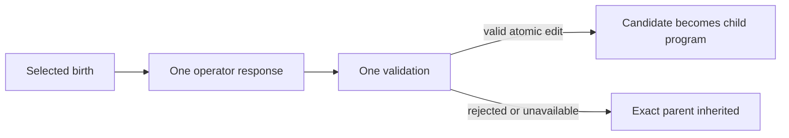

# Matched variation on EVOLVE IV-inspired physics

> **Status: deterministic integration and replay pilot.** This experiment runs
> five arms from matched initial conditions and writes a checksummed result
> bundle. Its cached arm contains synthetic fixture responses generated by a
> test double. The four fixed seeds are not an inferential sample, and none of
> the outputs is evidence for model or LLM performance.

> **Calibration update.** The original pilot's population ceiling of `40`
> frequently blocked otherwise-ready births, so its ecological summaries must
> not be interpreted as an operator comparison. A model-blind successor
> calibration now freezes a less capacity-censored world at
> `max_organisms = 176`; see the
> [calibration protocol](iv-world-calibration.md). Authentic model collection
> remains unrun.

## Research question

The long-term question is whether the *source of variation* changes what can
evolve when reproduction remains an ecological consequence rather than an
external score. This first repair establishes the plumbing needed to ask that
question without confounding the treatments at initialization.

For each master seed, all arms now start with the same canonical program bytes,
physical configuration, organism placement, and named mechanism seeds. Only
the inheritance/variation path differs. The committed configuration runs four
master seeds, 64 steps per run, and five arms: 20 short runs in total.

That is a protocol shakedown—not a powered operator comparison.

## Protocol at a glance

| Contract item | Pilot v1 |
|---|---|
| Program space | Flat schema-v1 product with seven mutable typed leaves and 6,624 valid programs |
| Initial programs | One committed canonical list, assigned identically in every arm |
| Physics | One committed set of non-seed parameters; the master seed varies only by replicate |
| Replicates | Four fixed master seeds: `1970`, `1998`, `2026`, `7301` |
| Variation gate | Probability `1.0` for variation arms; disabled for inheritance control |
| Proposal cap | At most eight birth-triggered opportunities per variation arm and seed; zero in the control |
| Edit contract | Exactly one changed leaf at atomic distance one |
| Selection | Native ecological birth, persistence, and death only; no score or model judge |
| Provider access | None; cached replay is offline and fail-closed |
| Claim status | Exploratory integration/replay pilot |

The exact configuration is
[`experiments/configs/iv-variation-pilot-v1.json`](../experiments/configs/iv-variation-pilot-v1.json).

The original configuration and reference bundle remain as a versioned record
of the integration repair. The calibrated five-arm qualification uses a
separate [configuration](../experiments/configs/iv-variation-qualification-v1.json),
separate engineering seeds, and the same eight-opportunity fixture contract;
its [fixture](../experiments/cache/iv-variation-qualification-fixture-v1.jsonl)
and [reference replay](../results/reference/iv-variation-qualification-v1) are
retained. Those qualification seeds are not reserved model-evidence seeds.

## Arms

| Arm ID | What it does | Important limit |
|---|---|---|
| `inherit_only` | Every child receives the exact parent program | Negative control; spends no proposal budget |
| `typed_point_v1` | Chooses one of seven fields uniformly, then applies its deterministic atomic successor | A typed heuristic, not a uniform draw over candidate programs |
| `random_atomic_edit_v1` | Chooses uniformly from the complete set of valid atomic neighbours | Reference random-edit distribution |
| `typed_homologous_recombination_v1` | Copies one atomic-compatible leaf from an eligible living donor | Homologous leaf crossover, not subtree GP |
| `cached_proposal_fixture_v1` | Replays raw, integrity-checked fixture responses through the shared validator | Synthetic random-edit test double; not a model treatment |

Schema v1 is a flat Cartesian product, not a recursive abstract syntax tree.
It has no subtrees to mutate or exchange. Calling the current recombination arm
“GP crossover” would therefore overstate the implementation. A genuine typed
GP arm requires a versioned recursive language and separately matched size and
variation contracts.

## One opportunity, one decision

Each budget unit permits one operator response and at most one candidate
validation. Nothing retries, asks for a replacement, or silently repairs a
response.



A response is accepted only when it parses as a valid closed schema-v1 program,
changes exactly one leaf, and has atomic distance one. The following ordinary
outcomes each cost one budget unit and give the child the exact parent program:

- malformed or otherwise invalid candidate;
- unchanged candidate;
- multi-field or non-atomic edit;
- recorded provider failure; or
- no eligible living donor for homologous recombination.

Infrastructure failures are different. A cache miss, duplicate key, checksum
failure, request-identity mismatch, or trusted in-repository operator contract
violation stops the run. It is not converted into biological inheritance and
must not be hidden inside an operator's rejection rate.

The four variation arms attempt proposals on their first eight selected births.
Later births inherit with `budget_exhausted` status. The inheritance control has
variation disabled and records ordinary exact-parent inheritance.

Eight is an upper cap, not an exogenous treatment dose. Each proposal can alter
the descendant program and thereby later birth timing, parent identity, donor
context, and realized opportunity count. This fixture qualification requires
all variation arms to reach the cap as an engineering check; authentic evidence
must instead preserve a horizon-complete shortfall as a treatment-mediated
outcome. Even when counts are equal, post-divergence request subjects are not
assumed to be paired.

## Matching and random streams

`IVSeedPlan-v1` derives seven explicit unsigned 64-bit seeds from each master
seed with `SeedSequence(master_seed).spawn(7)`. NumPy `PCG64` generators then
own distinct mechanisms:

| Ecology | Variation |
|---|---|
| initialization | variation gate |
| scheduling | operator-event seeds |
| reproduction | |
| mortality | |
| condition decay | |

This separation prevents an operator's internal random draws from directly
advancing the ecology, gate, or event-seed generators. The manifest records the
complete seed plan, and each budgeted event records its event seed.

The design supplies paired **initial conditions** and common mechanism seeds.
It does not supply permanent event-by-event common random numbers. Once an arm
changes a program, ecological states can diverge; state-dependent branches can
then consume different numbers of draws. Results should therefore not be
described as exact paired counterfactual trajectories after divergence.

Controller-free runs retain the legacy single-generator path. The named split
is opt-in for this matched experiment rather than a silent change to the older
diagnostics.

## Offline proposal cache

The simulator contains no provider or network call. A cache record binds the
raw response to a canonical request identity that includes:

- experiment, replicate, opportunity, birth, parent, and child identifiers;
- parent program and checksum;
- operator revision and event seed;
- prompt text, revision, and checksum;
- provider, model, model revision, and decoding settings; and
- response status, raw text and checksum, finish reason, usage, and provenance.

Replay requires an exact cache-key and identity match. The committed pilot's
profile is explicitly `fixture`: provider `fixture`, zero token usage, and raw
responses produced deterministically by the random atomic-edit operator. This
tests cache construction, lookup, provenance, validation, and byte replay. It
does **not** approximate, simulate, or benchmark a language model.

Configurations that require full cap use also require one cache record for
every configured seed and budgeted opportunity. A shortfall-enabled fixture
instead requires exactly the records its cached trajectory consumes. Missing
entries, duplicate keys, and valid but unused extras all stop replay, so the
cache input is exact rather than merely sufficient.

The underlying cache format distinguishes `fixture` from `model` provenance,
but the pilot runner is intentionally fixed to the fixture profile. Authentic
model responses belong in a new versioned treatment with a frozen collection
protocol. Ecosystem replay should remain offline.

For inspection without running anything, the repository retains the exact
[fixture cache](../experiments/cache/iv-variation-fixture-v1.jsonl) and the
[six-file reference bundle](../results/reference/iv-variation-pilot-v1). Its
manifest identifies the committed source used to generate it.

## Run and replay

Both the fixture path and output directory must be new; the runner refuses to
overwrite either.

```bash
IV_PILOT_DIR="$(mktemp -d)"

PYTHONPATH=src python3 experiments/run_iv_variation.py \
  --config experiments/configs/iv-variation-pilot-v1.json \
  --build-fixture-cache "$IV_PILOT_DIR/fixture.jsonl"

PYTHONPATH=src python3 experiments/run_iv_variation.py \
  --config experiments/configs/iv-variation-pilot-v1.json \
  --cache "$IV_PILOT_DIR/fixture.jsonl" \
  --output "$IV_PILOT_DIR/results"
```

Building to another new cache path should reproduce the fixture bytes. Replaying
the same config and cache into another new output directory should reproduce the
bundle bytes on the recorded environment and source revision. Run the focused
contract tests with:

```bash
PYTHONPATH=src python3 -m unittest \
  tests.test_iv_variation \
  tests.test_iv_matched_controller \
  tests.test_iv_variation_experiment
```

## Artifact contract

The cache is a required input and should be retained with the output bundle.
The runner writes canonical JSON/JSONL and refuses to overwrite an existing
directory.

| Artifact | Contents |
|---|---|
| `manifest.json` | Latest critical-source revision and per-source checksums, Python/NumPy versions, input checksums, full seed plans, arm IDs, matching contract, and limitations |
| `runs.jsonl` | One row per seed and arm, initial/final fingerprints, RNG-state hash, budget use, births/deaths, occupancy/coexistence/turnover summaries, final living matter, and program richness |
| `trajectories.jsonl` | Per-step population, material, construction/contact diagnostics, proposal spend, program richness, and invariant checks |
| `events.jsonl` | Seed and birth records with parent/child programs, proposal status and provenance, event seed, donor/cache identity, typed delta, and exact-parent fallback |
| `summary.json` | Descriptive per-arm arrays/totals/means plus protocol checks; no inferential ranking |
| `checksums.json` | SHA-256 digests for every other bundle file; self intentionally excluded |

The repaired runner emits schema v2 for the manifest, run, trajectory, and
summary records, while the unchanged event record remains v1. The retained
original pilot bundle is a source-revision-bound v1 artifact; the schema bump
prevents its older shapes from being confused with newly generated bundles.

The runner checks conservation and non-negativity after every step. It also
requires identical initial physical/program fingerprints within each master
seed. The pilot and qualification configurations require every variation arm
to reach their shared cap solely as a fixture engineering check. The artifacts
report the cap, realized spend, shortfall, and descriptive request-subject
matching separately. Complete ordinal slots with different subjects are also
reported separately from incomplete slots where one or more arms had no such
opportunity.

## What can and cannot be learned

This pilot can establish that:

- the five treatments initialize identically within a master seed;
- ecological and variation randomness are routed through named streams;
- proposal caps and realized opportunities have exact, auditable accounting;
- all variation candidate sources pass through the same atomic-edit adjudicator;
- rejection inherits the exact parent without retry; and
- the offline fixture and result bundle replay deterministically.

The run-level ecological summaries have deliberately literal definitions:

| Metric | Definition |
|---|---|
| `population_occupancy_auc_normalized` | Sum of post-step `n_alive`, divided by recorded steps times `max_organisms` |
| `population_ceiling_fraction` | Fraction of post-step records where `n_alive == max_organisms` |
| `capacity_blocked_births_total` | Number of reproduction-ready updates rejected by the simulator's population-cap gate; unlike the post-step ceiling fraction, this detects within-step capacity censoring hidden by later mortality |
| `capacity_gate_occupancy_peak` | Maximum within-step reservation count: the step-start living cohort plus newborns accepted so far; same-step deaths do not reopen slots |
| `capacity_gate_occupancy_fraction` | `capacity_gate_occupancy_peak / max_organisms`; the calibration headroom rule uses this gate-aligned quantity |
| `role_coexistence_fraction` | Fraction of post-step records with at least one producer and one recycler alive |
| `extinction_step` | First recorded step with `n_alive == 0`, otherwise `null` |
| `final_living_body_stored_matter` | Matter stored in living organisms at the final recorded step |
| `turnover_total` | Total births plus total deaths during the run |

The event and trajectory files additionally provide descriptive operator
validity/effective change, living-program richness, raw cross-type contact and
construction statistics, and material conservation. The raw `niche_index`
remains density-sensitive and is not evidence of niche formation.

With four hand-picked seeds, these values cannot support operator rankings,
p-values, confidence intervals, or superiority claims. The pilot also does not
yet operationalize general evolvability, offspring viability as a distinct
endpoint, descendant establishment, mutational robustness, reachable
behavioral novelty, recovery after unseen shocks, causal ecological innovation,
or open-endedness. It contains no model observations at all.

## Next evidence-bearing version

A substantive comparison should be a new preregistered protocol rather than a
reinterpretation of this fixture pilot. It should add:

1. explicit primary estimands and a justified number of independent master
   seeds;
2. generation- or lineage-aware establishment and persistence measurements;
3. density controls and causal ecological interventions where niche claims are
   contemplated;
4. a recursive schema-v2 language before introducing true subtree GP; and
5. collect the already-specified, versioned model-response cache only after the
   provider, immutable model revision, tokenizer, price schedule, and hard
   spend limit are frozen; ecosystem replay must contain no live calls.

Until then, the honest result is narrow but useful: the matched experimental
controller is executable, auditable, and ready for a larger evidence design.
